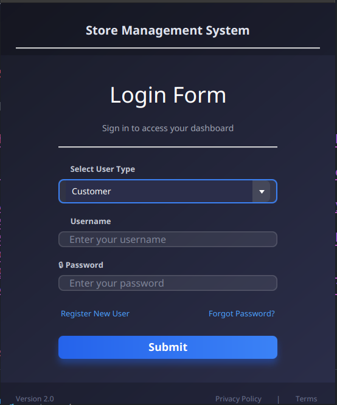
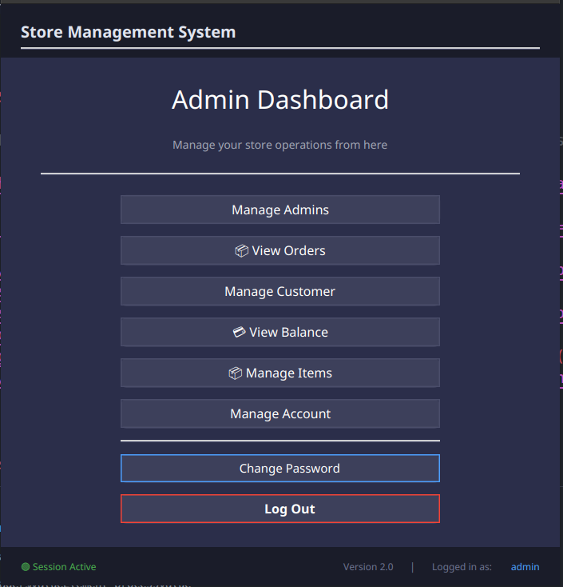
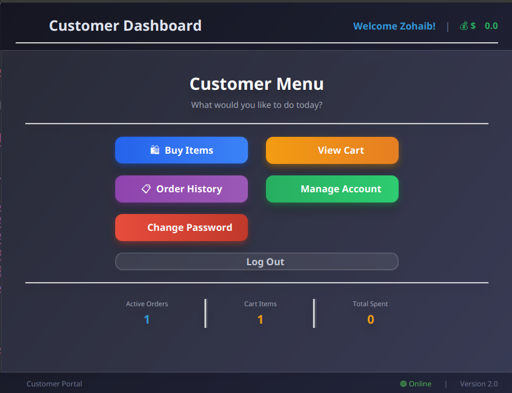
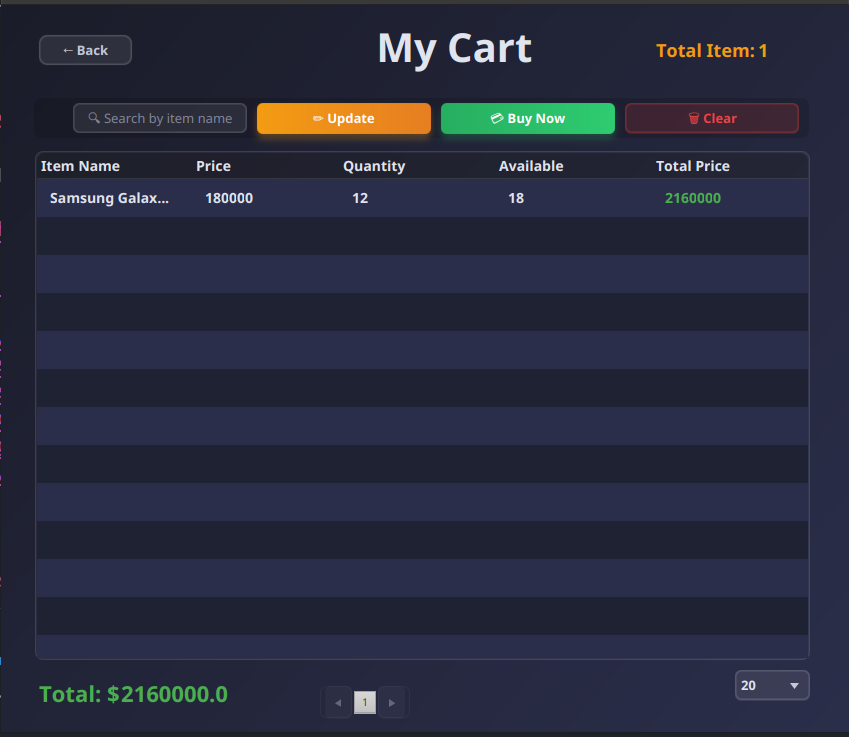
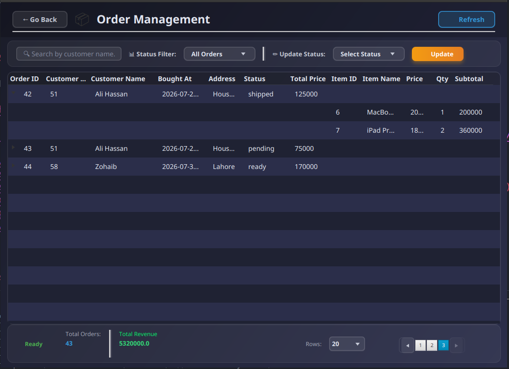

Here's a **professional, beautiful README** for your Store Management System. I've designed it to be both informative and visually appealing, making your project stand out on GitHub.

---

# 🏪 Store Management System

> A comprehensive JavaFX desktop application for managing retail store operations with PostgreSQL database

[](https://adoptium.net/)
[](https://openjfx.io/)
[](https://www.postgresql.org/)
[](https://maven.apache.org/)
[](LICENSE)
[](CONTRIBUTING.md)

---

## 📋 Table of Contents

- [Overview](#-overview)
- [Features](#-features)
- [Tech Stack](#-tech-stack)
- [Architecture](#-architecture)
- [Database Schema](#-database-schema)
- [Installation](#-installation)
- [Usage](#-usage)
- [Screenshots](#-screenshots)
- [Security Features](#-security-features)
- [API Reference](#-api-reference)
- [Contributing](#-contributing)
- [License](#-license)
- [Contact](#-contact)

---

## 🎯 Overview

**Store Management System** is a full-featured desktop application built with JavaFX that enables retail businesses to manage their operations efficiently. The system provides role-based access for **Admins** and **Customers**, with comprehensive features for inventory management, order processing, and user administration.

### 🚀 Key Highlights

- ✅ **Secure Authentication** with BCrypt password hashing
- ✅ **Real-time Inventory** management with stock tracking
- ✅ **Transaction Support** with ACID compliance
- ✅ **Role-Based Access** (Admin & Customer)
- ✅ **Cart Management** with persistent storage
- ✅ **Order Processing** with automated stock updates
- ✅ **Comprehensive Validation** for all inputs

---

## ✨ Features

### 👑 Admin Dashboard

| Feature              | Description                                   |
| -------------------- | --------------------------------------------- |
| **User Management**  | Create, update, delete, and view all users    |
| **Item Management**  | Add, update, delete, and view inventory items |
| **Order Management** | View and manage all customer orders           |
| **Store Dashboard**  | Overview of store statistics and performance  |

### 👤 Customer Dashboard

| Feature                | Description                                    |
| ---------------------- | ---------------------------------------------- |
| **Browse Items**       | View available products with real-time stock   |
| **Cart Management**    | Add, update, and remove items from cart        |
| **Checkout**           | Secure order placement with address validation |
| **Order History**      | View order history and status                  |
| **Account Management** | Update profile and change password             |

### 🔐 Security Features

- **BCrypt Password Hashing** - Industry-standard password encryption
- **SQL Injection Prevention** - All queries use PreparedStatement
- **Input Validation** - Comprehensive validation for all user inputs
- **Session Management** - Secure session handling with automatic logout
- **Transaction Safety** - ACID-compliant transactions with rollback support

---

## 🛠️ Tech Stack

### Backend

```
┌─────────────────────────────────────────────────────────────┐
│  Java 17                │  Core language                   │
│  PostgreSQL 14+         │  Production-ready database       │
│  BCrypt                │  Password hashing                │
│  JDBC                  │  Database connectivity           │
│  Maven                 │  Build automation                │
│  SLF4J + Logback       │  Logging framework              │
└─────────────────────────────────────────────────────────────┘
```

### Frontend

```
┌─────────────────────────────────────────────────────────────┐
│  JavaFX 17              │  UI framework                   │
│  FXML                   │  UI layout markup              │
│  CSS                    │  Styling                        │
│  Scene Manager          │  Navigation management         │
└─────────────────────────────────────────────────────────────┘
```

---

## 🏗️ Architecture

The application follows a **clean layered architecture** with clear separation of concerns:

```
┌──────────────────────────────────────────────────────────────┐
│                    PRESENTATION LAYER                        │
│  ┌──────────────┐  ┌──────────────┐  ┌──────────────┐      │
│  │   Controllers │  │     FXML     │  │     CSS      │      │
│  └──────────────┘  └──────────────┘  └──────────────┘      │
├──────────────────────────────────────────────────────────────┤
│                    SERVICE LAYER                             │
│  ┌──────────────┐  ┌──────────────┐  ┌──────────────┐      │
│  │  UserService │  │  ItemService │  │ OrderService │      │
│  └──────────────┘  └──────────────┘  └──────────────┘      │
├──────────────────────────────────────────────────────────────┤
│                     DATA ACCESS LAYER                        │
│  ┌──────────────┐  ┌──────────────┐  ┌──────────────┐      │
│  │   UserDAO    │  │   ItemDAO    │  │   OrderDAO   │      │
│  └──────────────┘  └──────────────┘  └──────────────┘      │
├──────────────────────────────────────────────────────────────┤
│                    DATABASE LAYER                            │
│  ┌────────────────────────────────────────────────────────┐  │
│  │                  PostgreSQL Database                   │  │
│  └────────────────────────────────────────────────────────┘  │
└──────────────────────────────────────────────────────────────┘
```

### Package Structure

```
com.store/
├── dao/              # Data Access Objects
│   ├── CartDAO.java
│   ├── CustomerDAO.java
│   ├── ItemDAO.java
│   ├── OrderDAO.java
│   ├── StoreDAO.java
│   └── UserDAO.java
├── db/               # Database utilities
│   └── Database.java
├── exception/        # Custom exceptions
│   ├── StoreException.java
│   ├── AuthenticationException.java
│   ├── DatabaseException.java
│   ├── TransactionException.java
│   ├── ValidationException.java
│   └── ResourceNotFoundException.java
├── GUI/              # UI Controllers
│   ├── controllers/
│   │   ├── AdminControllers/
│   │   ├── CustomerControllers/
│   │   ├── LoginController.java
│   │   └── ChangePasswordController.java
│   └── views/        # FXML files
├── model/            # Domain models
│   ├── User.java
│   ├── Item.java
│   ├── CartItem.java
│   ├── Order.java
│   └── OrderItem.java
├── service/          # Business logic
│   ├── UserService.java
│   ├── ItemService.java
│   ├── CartService.java
│   └── OrderService.java
├── util/             # Utilities
│   ├── ValidationUtil.java
│   ├── PasswordAuthUtil.java
│   ├── SessionManager.java
│   ├── SceneManager.java
│   └── MessageUtil.java
└── Transaction/      # Transaction management
    └── Transaction.java
```

---

## 🗄️ Database Schema

```sql
-- Users table with role-based access
CREATE TABLE users (
    userid     SERIAL PRIMARY KEY,
    name       VARCHAR(30) NOT NULL,
    username   VARCHAR(30) NOT NULL UNIQUE,
    password   TEXT NOT NULL,
    email      VARCHAR(50) NOT NULL UNIQUE,
    contact    VARCHAR(20) NOT NULL UNIQUE,
    role       VARCHAR(10) NOT NULL CHECK (role IN ('admin', 'customer'))
);

-- Items inventory
CREATE TABLE items (
    itemid     SERIAL PRIMARY KEY,
    itemname   VARCHAR(30) NOT NULL,
    price      INTEGER NOT NULL,
    quantity   INTEGER NOT NULL
);

-- Shopping cart
CREATE TABLE cart (
    cartid     SERIAL PRIMARY KEY,
    itemid     INTEGER REFERENCES items(itemid) ON DELETE CASCADE,
    userid     INTEGER REFERENCES users(userid) ON DELETE CASCADE,
    quantity   INTEGER NOT NULL,
    UNIQUE(itemid, userid)
);

-- Orders with transaction support
CREATE TABLE orders (
    orderid    SERIAL PRIMARY KEY,
    itemid     INTEGER REFERENCES items(itemid),
    userid     INTEGER REFERENCES users(userid),
    quantity   INTEGER NOT NULL,
    price      INTEGER NOT NULL,
    bought_at  TIMESTAMP DEFAULT NOW()
);

-- Store configuration
CREATE TABLE store (
    id         SERIAL PRIMARY KEY,
    name       VARCHAR(30) NOT NULL,
    balance    INTEGER NOT NULL
);
```

---

## 📦 Installation

### Prerequisites

- **Java 17** or higher
- **PostgreSQL 14** or higher
- **Maven 3.8** or higher
- **Git** (optional)

### Step-by-Step Setup

#### 1️⃣ Clone the Repository

```bash
git clone https://github.com/zohaib-kaleem-1/Store-Management.git
cd Store-Management
```

#### 2️⃣ Set Up Database

```bash
# Connect to PostgreSQL
psql -U postgres

# Create database
CREATE DATABASE store;

# Connect to the new database
\c store;

# Run the schema script
\i src/main/java/com/store/db/sql\ commands.txt
```

#### 3️⃣ Configure Database Credentials

Update `Database.java` with your credentials:

```java
private static final String URL = "jdbc:postgresql://localhost:5432/store";
private static final String USER = "your_username";
private static final String PASS = "your_password";
```

#### 4️⃣ Build the Project

```bash
mvn clean compile
```

#### 5️⃣ Run the Application

```bash
mvn exec:java -Dexec.mainClass="com.store.Main"
```

---

## 🚀 Usage

### Login Credentials

| Role         | Username   | Password       | Note                         |
| ------------ | ---------- | -------------- | ---------------------------- |
| **Admin**    | `admin`    | `Admin@123`    | Full system access           |
| **Customer** | `customer` | `Customer@123` | Limited to shopping features |

### Navigation Flow

```
┌─────────────┐
│   LOGIN     │
│             │
│ [Admin]     │──┐
│ [Customer]  │──┤
└─────────────┘  │
                 │
                 ▼
     ┌───────────────────────┐
     │     DASHBOARD         │
     │  ┌─────────────────┐  │
     │  │ Admin View       │  │  ──► User Management
     │  │ ├─ Manage Users  │  │  ──► Item Management
     │  │ ├─ Manage Items  │  │  ──► View Orders
     │  │ └─ View Orders   │  │
     │  └─────────────────┘  │
     │  ┌─────────────────┐  │
     │  │ Customer View    │  │  ──► Browse Items
     │  │ ├─ Shop Items   │  │  ──► Cart Management
     │  │ ├─ Cart         │  │  ──► Place Order
     │  │ └─ My Orders    │  │  ──► Order History
     │  └─────────────────┘  │
     └───────────────────────┘
```

---

## 📸 Screenshots

### Login Screen



### Admin Dashboard



### Customer Dashboard



### Cart Management



### Order Processing



---

## 🔒 Security Features

### Password Security

```java
// BCrypt hashing (industry standard)
public static String encoder(String password) {
    return BCrypt.hashpw(password, BCrypt.gensalt());
}

// Secure verification
public static boolean verifyPassword(String password, String hash) {
    return BCrypt.checkpw(password, hash);
}
```

### SQL Injection Prevention

```java
// All queries use PreparedStatement
String sql = "SELECT * FROM users WHERE username = ?";
try (PreparedStatement stmt = conn.prepareStatement(sql)) {
    stmt.setString(1, username);
    ResultSet rs = stmt.executeQuery();
}
```

### Transaction Safety

```java
// ACID-compliant transactions
conn.setAutoCommit(false);
try {
    // Multiple operations
    conn.commit();
} catch (Exception e) {
    conn.rollback();
    throw e;
}
```

---

## 📊 API Reference

### Service Layer Methods

#### UserService

| Method                                  | Description         | Returns   |
| --------------------------------------- | ------------------- | --------- |
| `verifyLogin(username, password, role)` | Authenticate user   | `boolean` |
| `getUserByUsername(username, role)`     | Fetch user details  | `User`    |
| `createUser(user)`                      | Register new user   | `boolean` |
| `updateUser(user)`                      | Update user profile | `boolean` |
| `deleteUser(id)`                        | Remove user         | `boolean` |

#### ItemService

| Method              | Description     | Returns      |
| ------------------- | --------------- | ------------ |
| `addItem(item)`     | Add new product | `boolean`    |
| `updateItem(item)`  | Update product  | `boolean`    |
| `deleteItem(id)`    | Remove product  | `boolean`    |
| `searchItems(name)` | Search products | `List<Item>` |

#### CartService

| Method                           | Description     | Returns   |
| -------------------------------- | --------------- | --------- |
| `addToCart(itemId, userId, qty)` | Add to cart     | `boolean` |
| `updateCart(cartItem)`           | Update quantity | `boolean` |
| `clearCart(userId)`              | Empty cart      | `boolean` |

---

## 🤝 Contributing

Contributions are welcome! Here's how you can help:

1. 🍴 **Fork** the repository
2. 🌿 **Create** a feature branch (`git checkout -b feature/amazing`)
3. 💻 **Commit** your changes (`git commit -m 'Add amazing feature'`)
4. 📤 **Push** to the branch (`git push origin feature/amazing`)
5. 📝 **Create** a Pull Request

### Development Guidelines

- Follow existing code style
- Write meaningful commit messages
- Update documentation for new features
- Test your changes thoroughly

---

## 📄 License

This project is licensed under the MIT License - see the [LICENSE](LICENSE) file for details.

```
MIT License

Copyright (c) 2024 Zohaib Kaleem

Permission is hereby granted, free of charge, to any person obtaining a copy
of this software and associated documentation files (the "Software"), to deal
in the Software without restriction...
```

---

## 📞 Contact

**Zohaib Kaleem**

[](https://github.com/zohaib-kaleem-1)
[](mailto:zohaib.kaleem@example.com)

---

## 🙏 Acknowledgments

- **JavaFX** - For the beautiful UI framework
- **PostgreSQL** - For the robust database
- **BCrypt** - For the secure password hashing
- **All Contributors** - For making this project better

---

## 📊 Project Status


---

<div align="center">
  <sub>Built with ❤️ by Zohaib Kaleem</sub>
</div>

---

## 📁 File Structure for README Images

Create a `screenshots` folder in your project root:

```
Store-Management/
├── screenshots/
│   ├── login.png
│   ├── admin-dashboard.png
│   ├── customer-dashboard.png
│   ├── cart.png
│   └── order.png
├── src/
└── README.md
```
